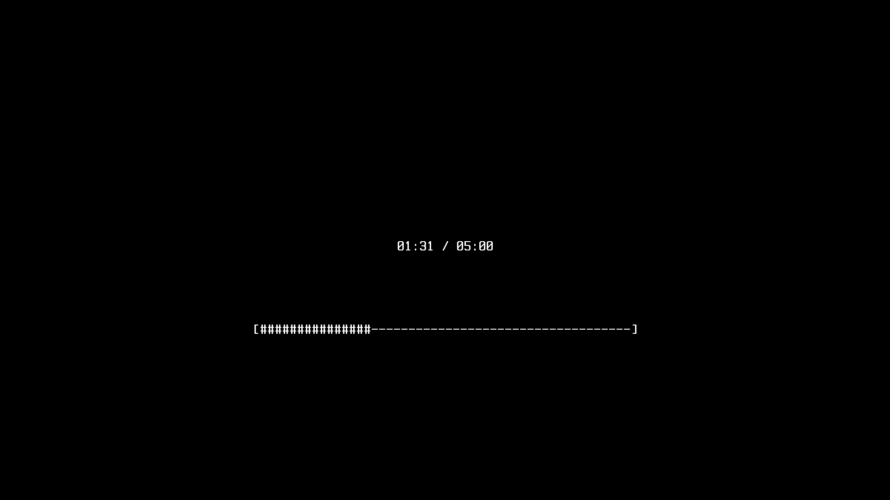

# pokoy

pokoy is lightweight daemon for X that helps prevent RSI and other computer related stress. It locks the screen and forces you to take regular breaks. Pokoy doesn't have any dependencies except xcb and consumes less than 2 MB of memory. See man page for more information.

## Dependencies

### Build dependencies

- Ubuntu:

  ```sh
  sudo apt-get install libxcb1-dev libxcb-keysyms1-dev libcxb-icccm4-dev libxcb-screensaver0-dev
  ```

- Arch Linux

  ```sh
  sudo pacman -S libxcb xcb-util-keysyms xcb-util-wm
  ```

### Runtime dependencies

- Ubuntu

  ```sh
  sudo apt-get install libxcb1 libxcb-keysyms1 libxcb-icccm4 libxcb-screensaver0
  ```

- Arch Linux

  ```sh
  sudo pacman -S libxcb xcb-util-keysyms xcb-util-wm
  ```

## Building and installation

Standard Makefile procedure:

```sh
sudo make install
```

If you'd like to install in other than default directory, then the last step should look like `sudo make PREFIX=/some/install/base/dir install`.

## Examples

```sh
$ pokoy -r # run daemon
$ pokoy
29:59
04:59

$ pokoy -s # sleep / deactivate (but don't kill) daemon
$ pokoy
Daemon is sleeping.

$ pokoy -s # wake up
$ pokoy -n # start first break now
$ pokoy -k # kill daemon
```

## Screenshot

<p align="center"></p>
